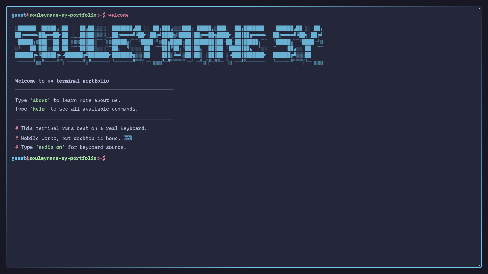
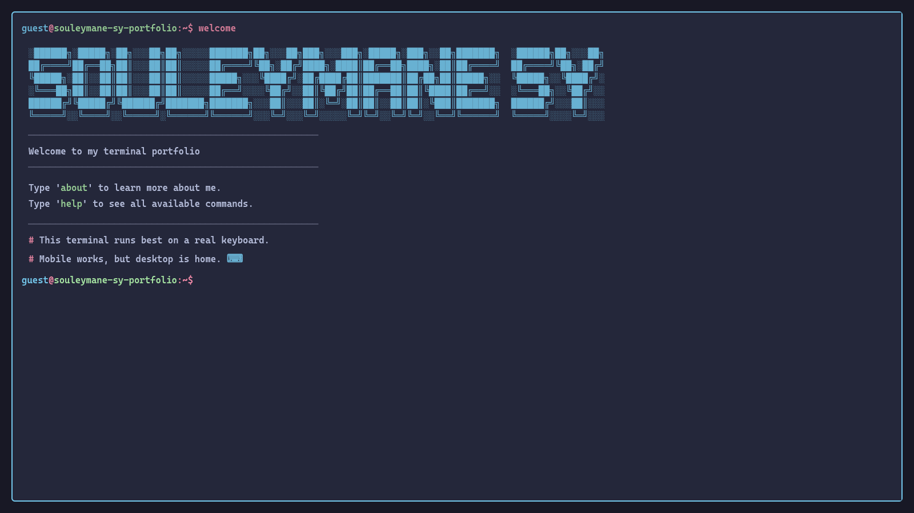
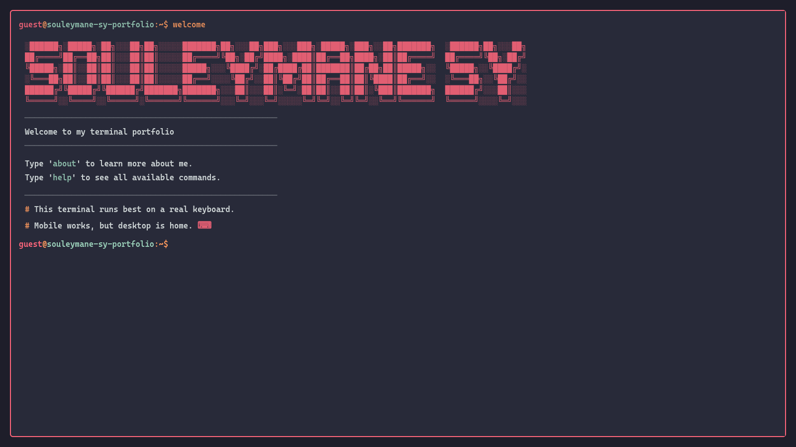
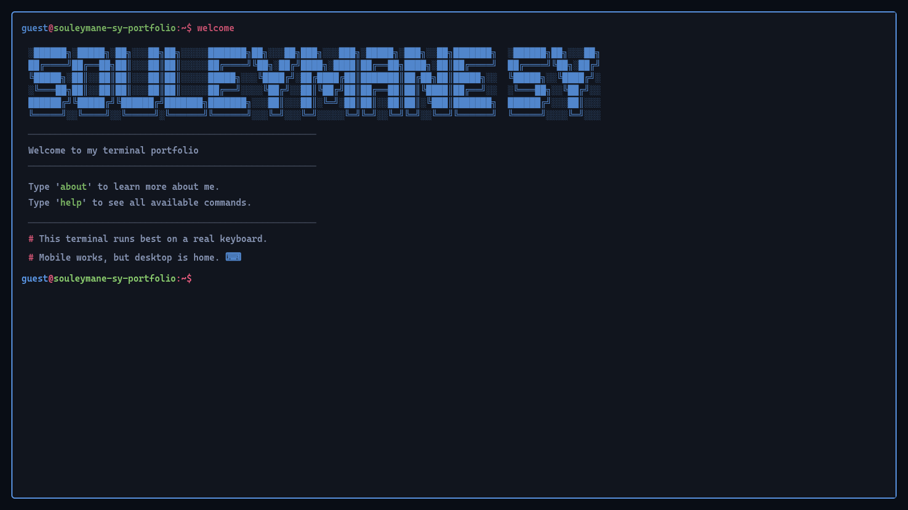
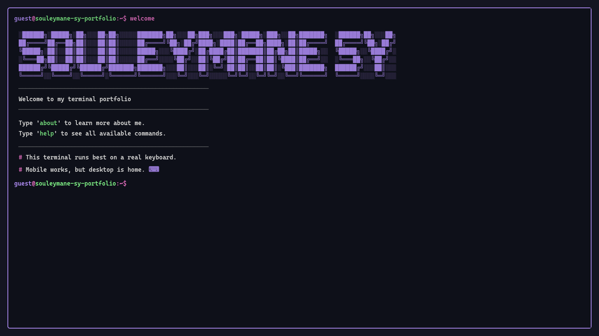

# Terminal Portfolio Website

## 

> A terminal-style portfolio you actually use like a terminal. Type commands, explore projects, switch themes, play a quiz — all from the command line.

**[Live Demo](https://terminal-portfolio-website-xi.vercel.app)** · **[Source Code](https://github.com/SouleymaneSy7/terminal-portfolio-website)**

---

## Table of Contents

- [Overview](#overview)
- [Features](#features)
- [Commands Reference](#commands-reference)
- [Theme & Font Switching](#theme--font-switching)
- [Design System](#design-system)
- [Technologies Used](#technologies-used)
- [Installation](#installation)
- [Project Structure](#project-structure)
- [Development Status](#development-status)
- [Inspiration](#inspiration)
- [Author](#author)

---

## Overview

This is a fully interactive browser-based terminal built as a portfolio. Visitors navigate the experience entirely through typed commands — no buttons, no menus, just a keyboard and a prompt.

Built from the ground up with Next.js 16, React 19, TypeScript and Tailwind CSS v4, with a focus on performance, accessibility and design consistency.

---

## Features

- **Real terminal emulation** — command parsing, history navigation, tab completion
- **Theme switching** — 4 color themes with localStorage persistence
- **Font switching** — 3 monospace fonts switchable at runtime
- **Command history** — navigate with arrow keys, persisted across sessions via localStorage
- **Tab autocomplete** — complete any command with a single keystroke
- **Loading indicators** — 5 variants (braille spinner, ASCII progress bar, dots, typewriter, rotating)
- **Live clock** — real-time date, time and timezone display
- **API integrations** — live weather, programming jokes, inspirational quotes
- **Interactive quiz** — 40-question Frontend quiz with XP system and rank progression
- **ASCII art** — cowsay, neofetch banner, welcome screen, quiz results
- **Accessibility** — ARIA live regions, aria-hidden on decorative ASCII art, focus management
- **Security** — DOMPurify XSS sanitization, strict HTTP security headers
- **Responsive** — works on mobile with a keyboard, optimized for desktop
- **SEO** — full OpenGraph, Twitter Card, sitemap, robots.txt, canonical URL

---

## Commands Reference

Type `help` in the terminal to see the full list. Here's a quick overview:

### Navigation & System

| Command           | Description                                                                |
| ----------------- | -------------------------------------------------------------------------- |
| `clear`           | Clear the terminal screen                                                  |
| `exit`            | Exit the terminal (close tab)                                              |
| `help`            | List all available commands                                                |
| `hostname`        | Display system information                                                 |
| `neofetch`        | Linux-style system summary with live theme and font                        |
| `theme <name>`    | Switch color theme — see [Theme & Font Switching](#theme-font-switching)   |
| `typeface <name>` | Switch terminal font — see [Theme & Font Switching](#theme-font-switching) |
| `welcome`         | Display the welcome banner again                                           |

### Information

| Command          | Description                                       |
| ---------------- | ------------------------------------------------- |
| `about`          | My story, journey and tech stack                  |
| `contact`        | All social networks and contact details           |
| `date`           | Live clock with date, time and timezone           |
| `time`           | Alias for `date`                                  |
| `email`          | Display my email address                          |
| `projects`       | Browse my most notable projects                   |
| `repo`           | This portfolio's source code                      |
| `resume`         | View or download my CV in French or English (PDF) |
| `weather <city>` | Real-time weather for any city                    |
| `whoami`         | Who is behind this terminal?                      |

### Fun & Games

| Command                       | Description                                              |
| ----------------------------- | -------------------------------------------------------- |
| `cowsay <message>`            | Make a cow say your message in ASCII                     |
| `game`                        | Start the Frontend Quiz — 40 questions, XP system, ranks |
| `game [1-3]`                  | Submit your answer                                       |
| `game stats`                  | View your performance and current rank                   |
| `game reset`                  | Clear all progress and start fresh                       |
| `game help`                   | Show all game commands                                   |
| `joke`                        | Random programming joke (live API)                       |
| `quote`                       | Inspiring or funny quote (live API)                      |
| `rps <rock\|paper\|scissors>` | Play rock-paper-scissors against the terminal            |
| `sudo`                        | Attempt to gain root access... 😄                        |

### Keyboard Shortcuts

| Shortcut   | Action                           |
| ---------- | -------------------------------- |
| `Tab`      | Autocomplete the current command |
| `↑` / `↓`  | Navigate command history         |
| `Enter`    | Execute command                  |
| `Ctrl + L` | Clear the terminal screen        |

---

## Theme & Font Switching

Preferences are saved to localStorage and restored automatically on every visit.

### Available Themes

```
theme catppuccin    → Catppuccin Macchiato (default) — soothing pastel
theme monokai       → Monokai — the timeless classic
theme tokyo-night   → Tokyo Night — for late-night coding sessions
theme dracula       → Dracula — dark and mysterious
```

### Available Fonts

```
typeface cascadia   → Cascadia Code (default) — crafted by Microsoft, embraced by all
typeface fira       → Fira Code — ligatures that tell a story
typeface jetbrains  → JetBrains Mono — engineered for developers
```

The `neofetch` command always reflects the currently active theme and font.

---

### Theme Previews

<details>
<summary><strong>Catppuccin Macchiato</strong> — default</summary>
<br>



Soothing pastel palette with a deep blue-purple background. The default theme — easy on the eyes during long sessions. Every shade is carefully calibrated to feel calm and readable.

</details>

<details>
<summary><strong>Monokai</strong></summary>
<br>



The timeless classic. Warm dark background with vibrant yellow, orange and green accents — instantly recognizable to any developer who has spent time in Sublime Text.

</details>

<details>
<summary><strong>Tokyo Night</strong></summary>
<br>



Deep blue-black background with soft blue and red accents. Inspired by the neon glow of the Tokyo skyline at night — made for late-night coding sessions.

</details>

<details>
<summary><strong>Dracula</strong></summary>
<br>



Dark and mysterious. Purple primary, pink secondary, mint tertiary on a near-black background. One of the most iconic dark themes in existence.

</details>

---

## Design System

All visual output across every command is driven by a single source of truth in `src/app/globals.css`. Changing a token once propagates to every command output automatically — no hunting through individual command files.

### CSS Tokens (in `@theme`)

#### Colors

Six semantic color roles cover every UI element in the terminal. All themes override these same six variables — swapping a theme only requires changing these six values.

```css
/* ── Catppuccin Macchiato — default ── */
/* Overridden per theme via html[data-theme] selectors */

--color-background-clr: oklch(
  0.2155 0.0254 284.06
); /* Page background                  */
--color-foreground-clr: oklch(
  0.2788 0.0353 276.94
); /* Terminal panel surface            */
--color-text-clr: oklch(
  0.8787 0.0426 272.28
); /* All body text                     */
--color-primary-clr: oklch(
  0.7906 0.0965 228.65
); /* ASCII art, strong accent, borders */
--color-secondary-clr: oklch(
  0.7556 0.1297 2.76
); /* Keys, labels, warnings ⚠          */
--color-tertiary-clr: oklch(
  0.8577 0.1092 142.72
); /* Commands, bullets •, success ✓    */
```

#### Typography — Font Families

Three monospace fonts are pre-loaded and switchable at runtime via the `typeface` command. All three fonts are loaded in `layout.tsx` using `next/font/local` for optimal performance.

```css
--font-fira-code: var(--font-fira-code); /* Active when data-font="fira"      */
--font-jetbrains-mono: var(
  --font-jetbrains-mono
); /* Active when data-font="jetbrains" */
--font-cascadia-code: var(
  --font-cascadia-code
); /* Active when data-font="cascadia"  */
```

#### Typography — Weights & Sizes

```css
/* ── Font weights ── */
--font-weight-regular: 400;
--font-weight-semi-bold: 600; /* Default body weight                          */
--font-weight-bold: 700; /* Section headers, command names, strong accent */

/* ── Fluid font sizes — scale smoothly between breakpoints ── */
--text-fs-body: clamp(0.875rem, 0.8393rem + 0.1786vw, 1rem); /* 14px → 16px */
--text-fs-subtitle: clamp(
  1.125rem,
  1.0893rem + 0.1786vw,
  1.25rem
); /* 18px → 20px */
--text-fs-title: clamp(1.25rem, 1.1786rem + 0.3571vw, 1.5rem); /* 20px → 24px */

/* ── Line height ── */
--leading-base: 1.5;
```

#### Spacing — Terminal Command Outputs

These four tokens control the rhythm of every command output. Edit once here and all outputs update instantly.

```css
--spacing-t-outer: 0.25rem; /* py — vertical padding on each output block  */
--spacing-t-section: 0.75rem; /* space-y — gap between major content sections */
--spacing-t-group: 0.25rem; /* space-y — gap between lines in a group       */
--spacing-t-footer: 0.125rem; /* space-y — gap between hint / footer lines    */
```

#### Opacity

```css
/* Strictly reserved for decorative separator lines ──── only.
   All other visual hierarchy is achieved through color roles,
   not opacity. This is intentional — one token, one purpose.  */
--opacity-sep: 0.3;
```

### Color Roles

Each color token has a strict semantic role. Following this table keeps all command outputs visually consistent.

| Token                              | Tailwind class              | Role                                                     |
| ---------------------------------- | --------------------------- | -------------------------------------------------------- |
| `--color-primary-clr`              | `text-primary-clr`          | ASCII art, neofetch heading, strong accent, border color |
| `--color-secondary-clr`            | `text-secondary-clr`        | Key labels in kv-rows, section headers, warning `⚠` icon |
| `--color-tertiary-clr`             | `text-tertiary-clr`         | Command names in hints, bullet points `•`, success `✓`   |
| `--color-text-clr`                 | `text-text-clr`             | All regular body text                                    |
| `--color-text-clr` + `opacity-sep` | `text-text-clr opacity-sep` | Separator lines `────` — and nothing else                |
| `--color-foreground-clr`           | `bg-foreground-clr`         | Terminal panel surface                                   |
| `--color-background-clr`           | `bg-background-clr`         | Page background                                          |

### Spacing Classes

Tailwind generates utility classes directly from the spacing tokens, making the design system truly token-driven.

| Tailwind class      | Token                 | Applied on                           |
| ------------------- | --------------------- | ------------------------------------ |
| `py-t-outer`        | `--spacing-t-outer`   | Root `<div>` of every command output |
| `space-y-t-section` | `--spacing-t-section` | Between major content sections       |
| `space-y-t-group`   | `--spacing-t-group`   | Between lines within a related group |
| `space-y-t-footer`  | `--spacing-t-footer`  | Between hint and footer lines        |

### Theme Switching — How the CSS Works

Theme overrides use attribute selectors on `<html>`. The specificity of `html[data-theme]` (`0,1,1`) beats `:root` (`0,1,0`) without needing `!important`. Font switching uses `html[data-font] body` (`0,1,2`) which beats the base `body` rule (`0,0,1`).

```css
/* All six color tokens are overridden — nothing else changes */
html[data-theme="dracula"] {
  --color-background-clr: oklch(0.203 0.022 277);
  --color-foreground-clr: oklch(0.175 0.018 277);
  --color-text-clr: oklch(0.968 0.004 106);
  --color-primary-clr: oklch(0.717 0.152 298);
  --color-secondary-clr: oklch(0.718 0.178 341);
  --color-tertiary-clr: oklch(0.879 0.182 145);
}

/* Font override — CSS var resolves in the context of body
   where Next.js injects the font variable as a className  */
html[data-font="jetbrains"] body {
  font-family: var(--font-jetbrains-mono);
}
```

### Accessibility Practices

- All ASCII art blocks carry `aria-hidden="true"` — screen readers skip decorative characters entirely
- All decorative separators `────`, bullets `•`, arrows `→` and syntactic quote marks `'` carry `aria-hidden="true"`
- Terminal output uses `role="log"` with `aria-live="polite"`, `aria-relevant="additions"` and `aria-atomic="false"`
- The terminal wrapper uses `role="application"` with a descriptive `aria-label`
- All external links include `rel="noopener noreferrer"` and `target="_blank"`
- `:focus-visible` styles on all interactive elements (links, buttons, input)
- Full `prefers-reduced-motion` support — CSS transitions and Framer Motion animations are disabled

---

## Technologies Used

### Core

- [Next.js 16](https://nextjs.org/) — React framework, SSR, routing
- [React 19](https://react.dev/) — UI library
- [TypeScript 5](https://www.typescriptlang.org/) — type safety throughout
- [Tailwind CSS v4](https://tailwindcss.com/) — utility-first styling with CSS custom properties
- [Bun](https://bun.sh/) — runtime and package manager

### UI & Animation

- [Framer Motion](https://www.framer.com/motion/) — terminal entry animations, staggered output, loading states

### Security

- [DOMPurify](https://github.com/cure53/DOMPurify) — XSS sanitization on all HTML command outputs
- Strict HTTP headers — `X-Frame-Options`, `HSTS`, `X-Content-Type-Options`, `Referrer-Policy`, `Permissions-Policy`

### Data & APIs

- [Axios](https://axios-http.com/) — HTTP client for weather, jokes, quotes APIs
- [date-fns](https://date-fns.org/) — date formatting for the live clock

---

## Installation

```bash
# Clone the repository
git clone https://github.com/SouleymaneSy7/terminal-portfolio-website.git

# Navigate to project directory
cd terminal-portfolio-website

# Install dependencies
bun install

# Start the development server
bun dev
```

---

## Project Structure

```
src/
├── app/
│   ├── globals.css          # Design tokens, theme overrides, font switching
│   ├── layout.tsx           # Root layout, font loading, SEO metadata
│   ├── page.tsx             # Home page
│   └── not-found.tsx        # 404 page
├── commands/
│   ├── about-command.ts
│   ├── contact-command.ts
│   ├── fun-command.ts       # exit, rps
│   ├── projects-command.ts  # projects, repo
│   ├── quiz-game-command.ts # 40-question frontend quiz
│   ├── resume-command.ts
│   ├── system-command.ts    # welcome, neofetch, hostname, whoami, sudo
│   ├── theme-command.ts     # theme & typeface switching + persistence
│   ├── weather-command.ts
│   └── index.ts
├── components/
│   ├── Terminal.tsx          # Main terminal shell, history, localStorage
│   ├── CommandInput.tsx      # Input field, tab completion, keyboard shortcuts
│   ├── CommandOutput.tsx     # Renders text / html / component / link blocks
│   ├── TerminalPrompt.tsx    # The guest@portfolio:~$ prompt
│   ├── LiveClock.tsx         # Real-time clock with box-drawing characters
│   ├── MobileBanner.tsx      # Mobile experience notice
│   └── ui/
│       └── loaders/          # 5 loading indicator variants
├── constants/
│   └── index.ts             # Command list, help output, date/time outputs
├── hooks/
│   └── useLocalStorage.ts   # SSR-safe localStorage hook with hydration guard
├── services/
│   ├── joke.service.ts
│   ├── quote.service.ts
│   └── weather.service.ts
├── types/
│   └── index.ts
└── utils/
    ├── command.ts           # executeCommand() — central command router
    └── date.ts              # Timezone and greeting helpers
```

---

## Development Status

- [x] Terminal interface with full command processing
- [x] Command history — navigation and localStorage persistence
- [x] Tab autocomplete
- [x] Theme switching — 4 themes with persistence
- [x] Font switching — 3 fonts with persistence
- [x] Design system — shared CSS tokens and consistent command output structure
- [x] Accessibility — ARIA roles, aria-hidden on ASCII art, focus management
- [x] API integrations — weather, jokes, quotes
- [x] Interactive Frontend Quiz — 40 questions, XP, ranks, session stats
- [x] ASCII art features — cowsay, welcome banner, neofetch
- [x] Resume download — French and English PDF
- [x] Security headers and XSS sanitization
- [x] Full SEO — OpenGraph, Twitter Card, sitemap, robots.txt
- [x] Mobile banner with responsive experience
- [ ] Easter eggs and hidden features

---

## Inspiration

This project draws inspiration from these developers and their work:

- [M4tt72's Terminal](https://term.m4tt72.com/) — clean terminal design and command architecture
- [Forrest's Portfolio](https://fkcodes.com/) — creative terminal-based portfolio execution

---

## Author

**Souleymane Sy** — Self-taught frontend developer from Coyah, Guinea-Conakry 🇬🇳

- [GitHub](https://github.com/SouleymaneSy7)
- [LinkedIn](https://linkedin.com/in/souleymanesy7)
- [Frontend Mentor](https://www.frontendmentor.io/profile/SouleymaneSy7)
- [Dev Challenges](https://devchallenges.io/profile/534cd213-3165-4c16-bdcf-058e1f468da0)
- [Twitter / X](https://twitter.com/Souleymanesy43)
- [Email](mailto:souleymanesycodes@gmail.com)

---

> Built with curiosity, persistence, and a deep love for web and the command line.
