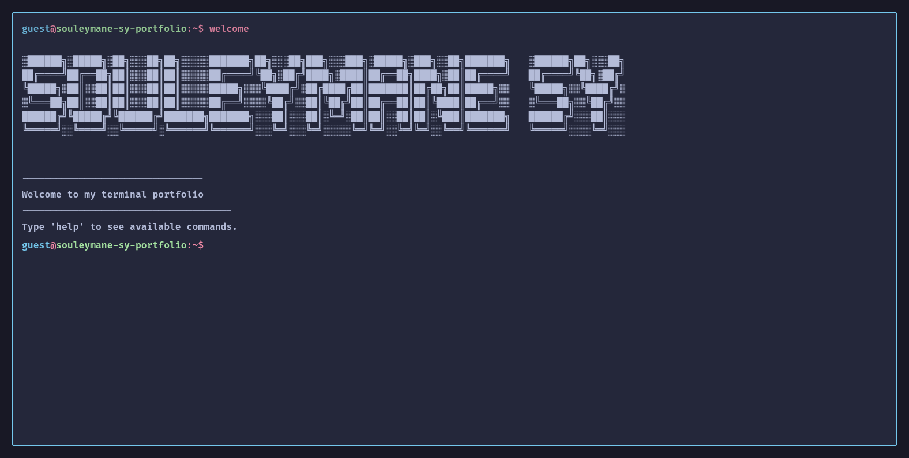

# Terminal Portfolio Website 🖥️



> ⚠️ **Note**: This project is currently under active development and construction. Features and documentation may change frequently.

## Overview

A portfolio website designed to mimic a terminal interface, providing a distinctive and interactive way to showcase my work and skills.

## 🌟 Features

- Terminal-like interface
- Interactive command system
- Custom commands and easter eggs

## 🛠️ Technologies Used

- Next.js
- Typescript
- TailwindCSS v4
- Bun

## 🚀 Installation

```bash
# Clone the repository
git clone https://github.com/souleymanesy7/terminal-portfolio-website.git

# Navigate to project directory
cd terminal-portfolio-website

# Install dependencies
bun install

# Start the development server
bun dev
```

## 🎯 Usage

Type `help` in the terminal interface to see available commands. Here are some basic commands:

- `about` - Learn more about me
- `clear` - Clear the terminal screen
- `date` - Display current date
- `exit` - Close terminal session
- `help` - Show available commands
- `hostname` - Display system hostname
- `neofetch` - Display system info
- `projects` - View my portfolio projects
- `sudo` - Try to gain admin access
- `theme` - Change terminal theme
- `time` - Show current time
- `welcome` - Show welcome message
- `whoami` - Show current user info

## 🔄 Current Development Status

- [x] Basic terminal interface
- [x] Core command functionality
- [x] Mobile responsiveness
- [x] Basic animations and transitions
- [x] Custom typing animations and effects
- [x] Advanced features and animations
- [ ] Command history navigation
- [ ] Complete project showcase
- [ ] Command auto-completion
- [ ] Easter eggs and hidden features
- [ ] Persistent storage for settings
- [ ] Multiple themes support

## 🎨 Design & Functionality Inspiration

This project draws inspiration from these amazing developers and their work:

- [M4tt72's Terminal](https://term.m4tt72.com/) - Clean terminal design and functionality.
- [Forrest's Portfolio](https://fkcodes.com/) - Creative terminal-based portfolio implementation.

## 👤 Author & Contact

- [GitHub](https://github.com/SouleymaneSy7) - Check out my Github & projects.
- [Frontend Mentor](https://www.frontendmentor.io/profile/SouleymaneSy7) - See my frontend challenges.
- [Dev Challenges](https://devchallenges.io/profile/534cd213-3165-4c16-bdcf-058e1f468da0) - View my coding solutions.
- [Twitter](https://twitter.com/Souleymanesy43) - Follow me for updates.

Connect with me to discuss web development, collaboration opportunities, or just to say hi! 👋

---

> ⚡️ **Note**: This README will be updated as the project evolves.
